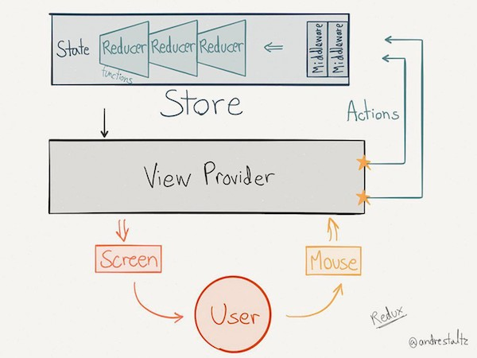
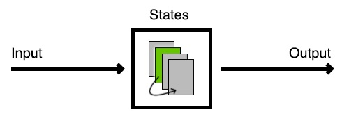

# Flow

If Redux/MVI and State machines architectures had a child, it would be **Flow**
 
## A Few Words About Redux/MVI

The basic idea is, you have a dispatcher that sends actions to the data store, and updates the view. It's an overall data flow architecture, where updates only go one way.



**Actions**: A plain object that is returned by a pure function with no
side-effects. The action object contains the “type” and any necessary
information to update the state. The object is sent to the store which
uses the information contained in the action object to provide the new
state. Actions describe that something happened.

**Reducer**: A pure function that takes the current state and action,
and performs an update on the state. It returns the new state.

**Store**: There is only one and it holds the entire state in a single
object.

**Middleware**: A function that is mostly used to introduce side effects
in the flow like API Calls, Logging, Crash Reporting, etc.. It uses
actions generated by the ViewProvider and are called after the new state
has been computed by reducers


## A Few Words About State Machines
There are different types of state machines but the one that fits in our
case is the finite state machine. This type of machine accepts an input and,
based on that input and the current state, decides what will be the next
state. It may also produce some output.



## What Flow brings
While `Redux/MVI` allows you to have predictable and replicable states with an easy architecture that makes testing very easy, it still has 3 downsides.
1. It's **action focused**. You can send actions from anywhere in the app, so it's up to the reducer to figure out if an action makes sense or not in this particular state
2. You deal with a **global** state of your app. Meaning that you still
need to go through a bunch of `if else` to figure out the actual state of
the screen.
3. You know all the possible actions available in your app but you can't have a global picture of what is happening

On the other hand, `State Machines` are **state focused** and define specific actions that a state can handle. So you can't make an action not handled by a state, it will simply be ignored. But there are still downsides

1. A state contains the business logic of what makes it go to the next state
2. Since states are responsible for making the decision of where to go next,
   1. It's hard to have a global picture of what is happening
   2. It's hard to add, remove and swap states easily in an existing state machine without going through all the existing states to be sure that everything is still linked correctly


Flow combines the ideas of Redux with the concept of state machines.

1. It allows you to describe your flow through an easy to read/write DSL and,
therefore, gives you the **global picture to understand the overall navigation**.
2. The DSL makes it easy to add, remove and swap states in an existing flow since the DSL is **statically checked by the compiler**
3. It uses the reducer and middleware concepts from Redux by transferring the business logic into pure functions and making it **much easier to test**.

## Getting Started

Let's do it for the example below:

| STATE   |      ACTION      |  GO TO |
|----------:|:-------------:|:------|
| LoginFormState | Submit | LoadingState |
| LoadingState |    Success  |   ProfileState |
|   | Failure |  ErrorState |
| ProfileState | LogOut | LoginFormState |
| ErrorState | Retry | LoadingState |

 Flow lets you write the state machine table above in a descriptive way:

### Defining States
Let's start with the states we need.

A state must extend `State<INPUT, ACTIONS>(name:String)`

- `INPUT` is for the kind of data the state consumes.
- `ACTIONS` is for actions allowed by the state.

Let's go through some examples:

##### LoginForm State

```kotlin
object LoginFormState : State<EmailField, LoginForm.SubmitCredentials>() {
	sealed class Action<O> {
	    data class Submit(val credentials: Credentials) : Action<Credentials>()
	    data class Validate(val email:String) : Action<String>()
	}

    fun submit(flow: Flow, credentials: Credentials) = dispatchAction(flow, Action.Submit(credentials))
    fun validate(flow: Flow, email: String) = dispatchAction(flow, Action.Validate(email))
}
```
`LoginFormState` consumes an `EmailField` and allows only `Submit` as an action. 

> Actions are typed and carry the data a state may have produced. In the example above, `Submit` carries the `Credentials` produced by the state when this action has been called.

> You need to write the function that will dispatch the action to the flow. In this case:

> `fun submit(...)` and `fun validate(...)`. **The action methods written in this way will be the only ones visible from a state**.

##### Loading State

```kotlin
object LoadingState : State<Credentials, Loading.Error>() {

	sealed class Action<O> {
    	data class Success(val profile: Profile) : Action<Profile>()
    	data class Failure(val error: LoadingState.Error) : Action<LoadingState.Error>()
    }
 
    sealed class Error {
	    object InvalidCredentials : Error()
        object NetworkUnavailable : Error()
        object Unexpected : Error()
    }
    
    fun success(flow: Flow, profile: Profile) = dispatchAction(flow, Action.Success(profile))
    fun error(flow: Flow, error: LoadingState.Error) = dispatchAction(flow, Action.Error(error))
}
```
`LoadingState` consumes `Credentials` and may produce multiple errors, represented in a sealed class, or be successful represented by the `Success` action. 

##### Profile State

```kotlin
object ProfileState : State<Profile,  Profile.Logout>() {
		object LogOut : Action<Nothing>()
    
    fun logOut(flow: Flow) = dispatchAction(flow, Profile.Action.LogOut)
}
```

Finally, `ProfileState` consumes a `Profile` and only allows to `LogOut`.

### Describing the flow

Now that we've decided what our states objects look like, we're ready to write a reducer for them. The reducer is a pure function that takes the previous state  and an action, and returns the next state.

```kotlin  
 forState(LoginFormState) { emailField, action ->
    when (action) {
        is LoginFormState.Action.Submit -> goto(CheckCredentialsState) using action.credentials
        is LoginFormState.Action.Validate -> stay using emailField.copy(action.email, action.email.isNotEmpty())
    }
}
```

`forState` allows you to handle a new state in the flow. It takes 2 parameters

1. The state to handle
2. A reducer that will figure out the next state and its data 

`goto` lets you define what the next state will be once the action has been dispatched.

`using` transforms the data produced by the current state into a data consumed by the new state.

Here is what the complete flow would look like:

```kotlin    
class LoginFlow : Flow({

    startWith(LoginFormState, EmailField(email = "", isValid = true))

    forState(LoginFormState) { emailField, action ->
        when (action) {
            is LoginFormState.Action.Submit -> goto(CheckCredentialsState) using action.credentials
            is LoginFormState.Action.Validate -> stay using emailField.copy(action.email, action.email.isNotEmpty())
        }
    }

    forState(LoadingState) { input, action ->
        when (action) {
            is LoadingState.Action.Success -> goto(ProfileState) using action.profile
            is LoadingState.Action.Failure -> goto(ErrorState) using action.error
        }
    }

    forState(ProfileState) { input, action ->
        when (action) {
            is ProfileState.Action.LogOut -> goto(LoginFormState) using (input.email to true)
        }
    }
})
```

`startWith` defines the initial state and initial data

`stay` prepares to end this action’s processing for not leaving the current state

`replying` modifies the current state data before leaving the current state and does not modify the state transition.


### Where does the business logic go ?

Since the function passed to `forState` is a pure function, what do I do if I need to make a network call? Or a database query?

Let's focus on `LoginFormState`:

```kotlin  
forState(LoginFormState) { emailField, action ->
	when (action) {
		is LoginFormState.Action.Submit -> goto(CheckCredentialsState) using action.credentials
	    ...
	}
}

forState(LoadingState) { input, action ->
	when (action) {
		is LoadingState.Action.Success -> goto(ProfileState) using action.profile
    is LoadingState.Action.Failure -> goto(ErrorState) using action.error
	}
}
```
What we need to do is pretty simple. We need to make some computations while the screen is in a `Loading` state and **call an action on the `LoadingState`** when it's done.

In order to do that we need to listen the transitions to add our custom logic right after the transition happened.

```kotlin
onTransition { flow, transition, action ->
	when (transition) {
		LoginFormState to LoadingState -> {
			val credentials = LoadingState.getData(flow)
			try{
				val profile = bg { authService.signIn(credentials)}.await()
				LoadingState.success(flow, profile)  
			} catch(e:Exception) {
				LoadingState.error(flow, UnexcpectedError)
			}
		}
	}
}
```
> This example is using [coroutines](https://kotlinlang.org/docs/reference/coroutines.html) but we could use [RxJava](https://github.com/ReactiveX/RxJava), or anything else.

>Notice these 2 lines: **`LoadingState.success(flow, profile)`** and **`LoadingState.error(flow, UnexpectedError)`**. We call actions from `LoadingState` based on our service's result. 


We have now a solution that solves all our problem:

- **Have an easy way to add, remove, swap steps from flow**: Thanks to the dsl and its static verification, it's now very easy to change the flow without breaking everything. Everything is statically verified by the compiler, so if it compiles, it should work.

- **Easy on-boarding for new hires and global picture of what is happening in the code**: The DSL gathers all the information needed to understand how the code is working by assembling independents components together to make something consistent.

- **Easy to test**: All the business code is isolated into functions with clear inputs and outputs. 

- **Easy to reproduce bugs**: Due to the nature of this unidirectional data flow, we simply need to replay all the actions with the right data to reproduce bugs and fix them.

Here is what the full Flow looks like:

```kotlin    
class LoginFlow : Flow({

    startWith(LoginFormState, EmailField(email = "", isValid = true))

    forState(LoginFormState) { emailField, action ->
        when (action) {
            is LoginFormState.Action.Submit -> goto(CheckCredentialsState) using action.credentials
            is LoginFormState.Action.Validate -> stay using emailField.copy(action.email, action.email.isNotEmpty())
        }
    }

    forState(LoadingState) { input, action ->
        when (action) {
            is LoadingState.Action.Success -> goto(ProfileState) using action.profile
            is LoadingState.Action.Failure -> goto(ErrorState) using action.error
        }
    }

    forState(ProfileState) { input, action ->
        when (action) {
            is ProfileState.Action.LogOut -> goto(LoginFormState) using (input.email to true)
        }
    }
    
    onTransition { flow, transition, action ->
		when (transition) {
            LoginFormState to LoadingState -> checkCredentials(authService, LoadingState, flow)
        }
    }
})

fun checkCredentials(authService:AuthService, state:LoadingState, flow:Flow){
	val credentials = LoadingState.getData(flow)
	try{
		val profile = bg { authService.signIn(credentials)}.await()
		LoadingState.success(flow, profile)  
	} catch(e:Exception) {
		LoadingState.error(flow, UnexpectedError)
	}
}
```

## How do I use this flow in my activity ?

### Observing States
Activities (or any other View Controller) becomes pretty dumb. The only thing we need to do is make the Activity *observe* the current state and react to it.

```kotlin
 override fun onCreate(savedInstanceState: Bundle?) {
        super.onCreate(savedInstanceState)
        viewModel.observableState.observe(this) { state, flow ->
            when (state) {
                is Loading -> {
                    progressDialog = ProgressDialog.show(this, "Loading", "Loading", true)
                }

                is Error -> {
                    progressDialog?.dismiss()
                    AlertDialog.Builder(this)
                        .setMessage(state.getData(flow).errorMessage)
                        .setCancelable(true)
                        .setPositiveButton("RETRY") { _, _ -> viewModel.submitCredentials(emailInput.text!!, passwordInput.text!!) }
                        .setNegativeButton("CANCEL") { dialog, _ -> dialog.cancel() }
                        .show()
                }

                is Profile -> {
                    progressDialog?.dismiss()
                    startActivity<ProfileActivity>()
                }
            }
        }
    }
```

Basically, the only job of the activity, now, is to make basic UI operations depending on the state we are in, such as: Change View visibility, Change text color, etc... No more logic.

Therefore, testing an activity has become very easy. We just need to emit a state and check, using Espresso, or any other UI testing framework, the state of our activity's components.

### Making Actions
Calling State actions is pretty straight forward when we look at the example below:

```kotlin
fun submitCredentials(credentials: Credentials) {
	when (flow.currentState) {
        EmailState -> flow.currentStateAs<EmailState>()?.submitEmail(flow, credentials)
        EmailErrorState -> flow.currentStateAs<EmailErrorState>()?.retry(flow, credentials)
	}
}
```

Only actions supported by a state are dispatched. All the other actions are ignored. For instance, if we click on the submit button multiple times, only the first click will be taken into account. The others will be ignored since we switched into another state that doesn't handle the `SubmitCredentials` action, in this case, the `Loadingstate`


### LICENCE
```  
Copyright 2018 Mounir Boudraa

   Licensed under the Apache License, Version 2.0 (the "License");
   you may not use this file except in compliance with the License.
   You may obtain a copy of the License at

       http://www.apache.org/licenses/LICENSE-2.0

   Unless required by applicable law or agreed to in writing, software
   distributed under the License is distributed on an "AS IS" BASIS,
   WITHOUT WARRANTIES OR CONDITIONS OF ANY KIND, either express or implied.
   See the License for the specific language governing permissions and
   limitations under the License.  
```